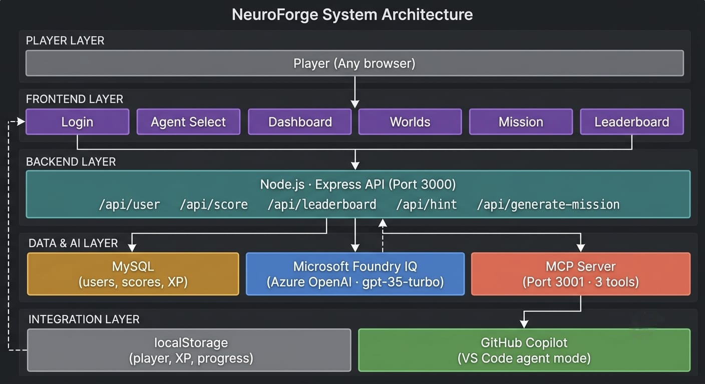

# NeuroForge 🧠⚡
### Forge Your Mind. Defend The Future.

[](https://aka.ms/agentsleague/aisf)
[](https://aka.ms/agentsleague/aisf)
[](https://learn.microsoft.com/azure/foundry/agents/concepts/what-is-foundry-iq)
[](https://neuroforge-rhea.netlify.app)
[](LICENSE)

---

> *Cybersecurity isn't learned by reading slides. It's learned by making decisions under pressure.*

**NeuroForge** is a gamified cybersecurity simulation platform where players make real-world security decisions across **200 AI-generated missions** spanning four cyber worlds. Every mission is born live — powered by **Microsoft Foundry IQ (Azure OpenAI gpt-35-turbo)** — so no two sessions are ever the same. Built for Microsoft Agents League 2026.

---

## 🎬 Demo

[](https://youtu.be/XKH8iI1CWvY?si=EjRyBolkLfiCLEaf)

🔗 **Live Platform:** [neuroforge-rhea.netlify.app](https://neuroforge-rhea.netlify.app)

---

## 🌍 The Four Worlds

Each world is a distinct cybersecurity domain. Fifty levels each. Progressive difficulty scaling from EASY to EXTREME.

| World | Domain | Threat Focus |
|-------|--------|-------------|
| 🔐 **Security World** | Human Attack Surface | Social engineering, SIM swapping, deepfake impersonation, insider threats, phishing |
| ☁️ **Cloud World** | Cloud Infrastructure | S3 misconfigurations, IAM privilege escalation, exposed API keys, container escapes |
| ⚡ **Logic World** | Technical Vulnerabilities | SQL injection, XSS, IDOR, JWT vulnerabilities, broken authentication, SSRF |
| 🔥 **Incident Response** | Live Attack Scenarios | Ransomware containment, lateral movement detection, DDoS mitigation, forensics |

---

## ✨ Core Features

### 🤖 AI-Powered Mission Generation — Microsoft Foundry IQ
Every mission is dynamically generated the moment a player enters. The backend fires a precision prompt to **Microsoft Foundry IQ (Azure OpenAI gpt-35-turbo)** specifying world, level, and difficulty. The AI returns a fully structured mission — realistic corporate scenario, fake internal URL, clear objective, and four choices with detailed feedback for each.

- **Zero repetition** — world-specific topic enforcement prevents duplicate scenarios
- **Difficulty scaling** — EASY missions have clear red flags; EXTREME missions (levels 41-50) include deliberate red herrings and convincing wrong answers designed to challenge even experienced security professionals
- **Live feedback** — wrong answers explain the blast radius — what that decision would cost a real organization

### 💡 Socratic Hint System
Stuck on a mission? One click fires a live request to **Microsoft Foundry IQ** which returns a Socratic hint — a nudge that redirects thinking without giving away the answer. Appears live in the Agent Terminal styled as a real cybersecurity operations feed. An auto-hint fires after 30 seconds of inactivity so no player gets left behind.

### 🏆 Live Leaderboard & XP System
Every correct answer pushes XP to MySQL via the backend. The leaderboard runs a nested SQL query — MAX XP per world per player, then SUM across all four worlds — preventing replay farming.

| Badge | XP Required |
|-------|------------|
| 🩶 Recruit | 0+ |
| 🟣 Incident Responder | 500+ |
| 🔵 Phishing Hunter | 1,000+ |
| 🟢 Firewall Guard | 2,000+ |
| 🟡 Security Agent | 5,000+ |
| 🟠 Threat Analyst | 10,000+ |
| 🔴 Cyber Commander | 25,000+ |
| 💀 NeuroForge Legend | 57,000 (All 200 missions) |

### 🤖 MCP Server — GitHub Copilot Integration
NeuroForge ships with a **Model Context Protocol server** that exposes the game as a live tool provider inside **GitHub Copilot in VS Code.** Developers access cybersecurity training without leaving their editor.

| Tool | Description |
|------|-------------|
| `get_mission` | Generate a live AI mission by world and difficulty inside Copilot Chat |
| `get_hint` | Get a Socratic hint for any cybersecurity scenario |
| `get_leaderboard` | Fetch the live top 10 leaderboard as a markdown table |

---

## 🏗️ Architecture



```
Player (Browser)
      ↓
Frontend — Netlify (HTML/CSS/JS)
      ↓
Backend API — Render (Node.js Express)
      ↓              ↓                    ↓
MySQL DB        Microsoft              MCP Server
(Aiven)       Foundry IQ              (Port 3001)
            Azure OpenAI                  ↓
           gpt-35-turbo            GitHub Copilot
                                    VS Code Agent
```

### Tech Stack

| Layer | Technology |
|-------|-----------|
| Frontend | HTML, CSS, JavaScript, Tailwind CSS |
| Backend | Node.js, Express.js |
| Database | MySQL on Aiven |
| AI | Microsoft Foundry IQ — Azure OpenAI gpt-35-turbo |
| Frontend Hosting | Netlify |
| Backend Hosting | Render |
| MCP Integration | Model Context Protocol Server |
| AI-Assisted Dev | GitHub Copilot |

---

## 🧠 XP & Difficulty System

| Levels | Difficulty | XP per Mission | Description |
|--------|-----------|---------------|-------------|
| 1-10 | EASY | 100 XP | Clear scenarios, obvious red flags |
| 11-25 | MEDIUM | 200 XP | Subtle clues, requires domain knowledge |
| 26-40 | HARD | 350 XP | Red herrings, multiple plausible answers |
| 41-50 | EXTREME | 500 XP | Sophisticated attack chains, deeply misleading |

**Maximum XP per world: 14,250 | Maximum total XP: 57,000**

---

## 🔌 API Reference

| Endpoint | Method | Description |
|----------|--------|-------------|
| `/api/generate-mission` | POST | Generate AI mission via Foundry IQ |
| `/api/hint` | POST | Get Socratic hint via Foundry IQ |
| `/api/score` | POST | Save player score to MySQL |
| `/api/leaderboard` | GET | Fetch top 10 players |
| `/api/user` | POST | Register/update player profile |
| `/api/progress/:id` | GET | Fetch player progress |

---

## 🚀 Local Setup

### Prerequisites
- Node.js 22.x
- MySQL database
- Azure OpenAI deployment (Foundry IQ)

### Installation

```bash
# Clone the repository
git clone https://github.com/rh3eeacysec/NeuroForge.git
cd NeuroForge/neuroforge-backend

# Install dependencies
npm install

# Configure environment variables
cp .env.example .env
# Fill in your values:
# AZURE_OPENAI_KEY=
# AZURE_OPENAI_ENDPOINT=
# AZURE_OPENAI_DEPLOYMENT=
# DB_HOST=
# DB_USER=
# DB_PASSWORD=
# DB_NAME=
# DB_PORT=

# Start the server
npm start
```

Open `index.html` in your browser or serve the frontend files directly.

---

## 🤖 GitHub Copilot Usage

GitHub Copilot was used extensively throughout the entire build of NeuroForge:

- **MySQL schema design** — table structure, composite unique keys, ON DUPLICATE KEY UPDATE patterns
- **SQL aggregation logic** — nested query for leaderboard MAX/SUM across worlds
- **Express route architecture** — all five API route handlers
- **MCP tool definitions** — three tool definitions with input schemas and formatted markdown responses
- **Mission rendering pipeline** — dynamic DOM generation for choices, terminal feed, result panel
- **Cyberpunk UI system** — scanline overlays, hologram panels, glitch animations, glassmorphism effects
- **Retry engine** — exponential backoff for Render cold starts
- **Difficulty scaling prompt** — the world-specific prompt engineering that prevents topic repetition

---

## 🏆 Judging Criteria Alignment

| Criterion | Weight | How NeuroForge Delivers |
|-----------|--------|------------------------|
| **Accuracy & Relevance** | 20% | Fully meets Creative Apps requirements. Foundry IQ deeply integrated as the core mission and hint engine. GitHub Copilot used throughout. MCP server exposes NeuroForge inside VS Code. |
| **Reasoning & Multi-step Thinking** | 20% | AI prompt chain: world → level → difficulty → topic enforcement → scenario generation → choice generation → feedback generation. Hint system adds a second reasoning layer per mission. |
| **Creativity & Originality** | 15% | A novel gamified cybersecurity platform with AI-generated missions. Cyberpunk aesthetic, agent identity system, and MCP integration make it genuinely novel. |
| **User Experience & Presentation** | 15% | Full cyberpunk UI with hologram panels, scanlines, agent terminal feed, XP bar, progress rings. Deployed live. Playable by judges immediately. |
| **Reliability & Safety** | 20% | No credentials in repo. Retry engine handles Render cold starts. UptimeRobot keeps backend alive 24/7. Azure trial covers full competition period. |
| **Community Vote** | 10% | Shareable concept — "play a cybersecurity game powered by AI" is immediately compelling to developers. |

---

## 🔒 Security

- ✅ No API keys or credentials committed to this repository
- ✅ All secrets managed via environment variables on Render
- ✅ `.env` is gitignored
- ✅ No customer PII stored beyond player-chosen names and self-assigned IDs
- ✅ No confidential or proprietary information in this repository

Please do not report security vulnerabilities through public GitHub issues. See [Microsoft Security Policy](https://aka.ms/SECURITY.md).

---

## 📜 License

MIT License — see [LICENSE](LICENSE) for details.

This project adopts the [Microsoft Open Source Code of Conduct](https://opensource.microsoft.com/codeofconduct/). See [CODE_OF_CONDUCT.md](CODE_OF_CONDUCT.md) for details.

---


---

## 👩‍💻 About the Creator

Hi, I'm **Rhea Prajapati** - cybersecurity and cloud security student who builds projects at the intersection of security, AI, and modern web technologies.

I'm currently focused on application security, cloud security, API security, ethical hacking, and AI-powered security solutions. I believe the best way to learn cybersecurity is through hands-on experience — which is exactly why NeuroForge exists. Complex security concepts shouldn't live in textbooks. They should be lived through decisions, consequences, and pressure.

**My areas of interest:**

- 🔐 Cybersecurity & Digital Forensics
- ☁️ Cloud Security
- 🌐 Web Application Security
- 🔌 API Security
- 🤖 AI in Security
- ⚔️ Ethical Hacking
- 🛡️ Secure Software Development

*Always learning. Always building. Always securing.*

---
## 👤 Author
---

**Rhea Prajapati**
Microsoft Learn: `Rhea-8387`
GitHub: [@rh3eeacysec](https://github.com/rh3eeacysec)

Built for **Microsoft Agents League 2026** — Creative Apps Track
Powered by **Microsoft Foundry IQ**

---

> *Two hundred missions. Four worlds. Zero repeated questions.*
> *Because every mission is born in the moment you need it.*
>
> **Forge your mind. Defend the future.**

---

